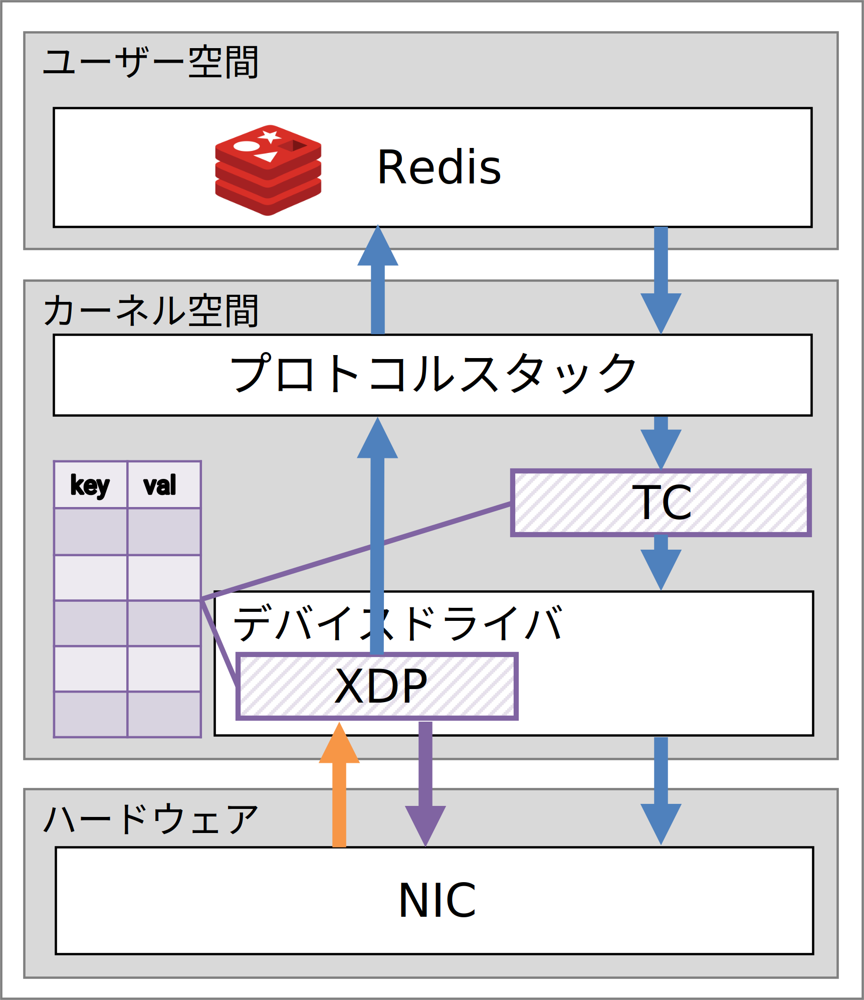

# Redis BPF Cache

XDPとTCで実装したRedisのキャッシュアプリケーション。
[”NCA: Accelerating Network Caching with eXpress Data Path"](https://ieeexplore.ieee.org/document/9680837)を参考に作成。

XDPでREADリクエストを解析し、キャッシュヒット時にデバイスドライバ層でレスポンスを返すことで高速化を図る。

## インストール

ソースコードのダウンロード。
```
git clone https://github.com/88IO/redis-bpf-cache --recursive
```

ncaディレクトリに移動
```
cd nca
```

eBPFプログラムとローダープログラムのビルド。[xdp-project/xdp-tutorial](https://github.com/xdp-project/xdp-tutorial)のMakefileを使用。
```
make
```

XDPプログラムのアタッチ。
```
sudo ./xdp_loader -d <DEVICE NAME>
```

TCプログラムのアタッチ。
```
sudo bash ./tc_loader <DEVICE NAME>
```

## 構成


## パフォーマンス

論文公開前のため非公開。
